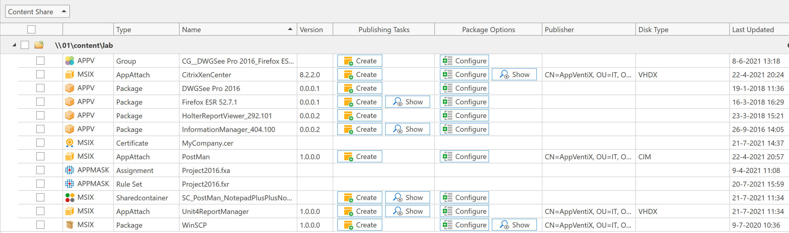
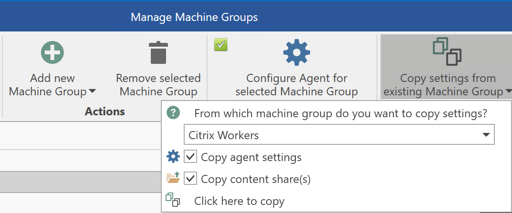
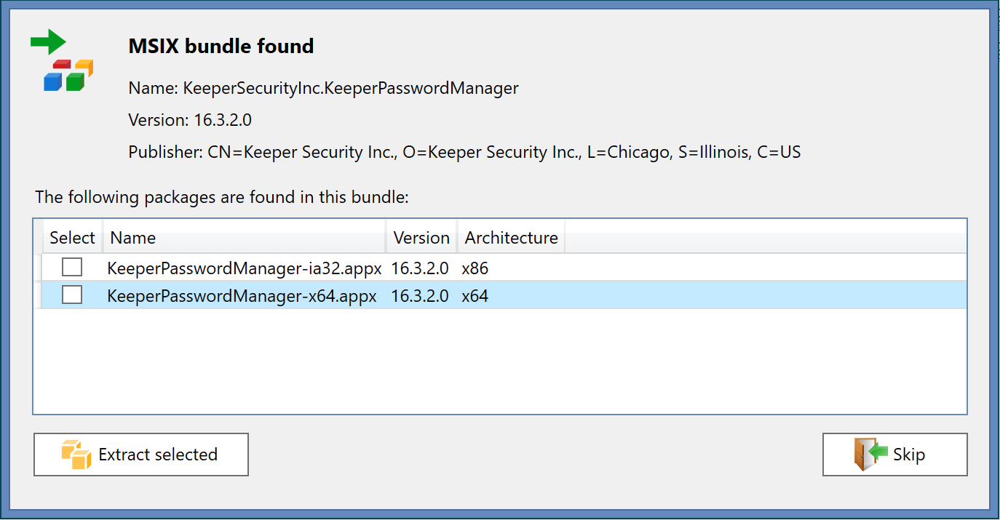
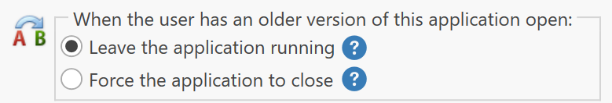

# AppVentiX 3.3.23 release notes

We are excited to announce that AppVentiX 3.3 is now available, make sure to read the release notes of version 3.2 as well to check out all the latest features.

## What's new in AppVentiX 3.3

## Content inventory redesign

In the content inventory you can now directly see which packages are published and which packages have options (like draining) configured. In the below screenshot you can see an example how this looks like, a show button will become visible when publishing tasks or package options are configured for a package, by clicking on the show button you will directly see the configured publishing tasks or options so you don't have to search them. The show button will be hidden when no publishing tasks or options are configured.

## Copy machine group settings

In the manage machine groups window you can now easily copy settings from an existing machine group to another. This makes it easier to manage multiple machine groups with the same settings.

## Support for MSIX bundles

AppVentiX will now detect MSIX bundles, you can see the contents and extract packages from the bundle.

## Improved application upgrade experience

It was already easy to upgrade applications in real-time with AppVentiX, but now you are even more flexible when upgrading applications. In the publishing task you can select what should happen when an older version of the application is currently running when the new version is deployed. By default, the old version will stay active and the new version will become active when the user closes the application. But if you want to make sure the update is pushed immediately, for example to align with a back-end update or a version rollback, you can choose to close the old version immediately.

## Integration with automatic image build procedures

If you use automated image build mechanisms or pipelines it's easy to integrate this with AppVentiX, in the admin guide you will find methods how you can check if AppVentiX has finished pre-caching packages. When you are building your image and want some or all packages to be present in the image, you can now easily detect if this stage has been finished so you can continue your automatic image build process. Please check the admin guide for more information.

## Other improvements and fixes

The following list of improvements and fixes are also implemented in version 3.3:

- Improved Azure Virtual Desktop (AVD) integration, the connection with AVD has been optimized and an issue has been fixed when upgrading applications that are published in AVD
- Improved support for seamless application publishing scenarios (without full desktop), information about starting published applications is now also logged in the AppVentiX agent event log
- Reading configuration from the configuration share has been optimized, part of the configuration is now cached
- When enabled, the disable logon feature did not always work, this has been fixed
- An issue has been fixed when pre-caching a lot of App-V packages at the same time (for example in the image build stage)
- Support has been added for older App-V manifest formats (for example upgraded packages from App-V 4.6)
- It's now also possible to pre-cache MSIX packages as part of your image build process
- Enhanced support for Windows 11 and Windows Server 2022, AppVentiX has been verified to work great on the latest Windows releases, both App-V and MSIX (app attach)
- Multiple other fixes and improvements

---

*Source: [AppVentiX release history](https://appventix.com/appventix-release-history/).*
