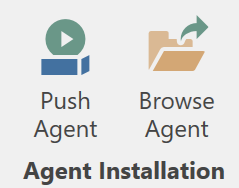
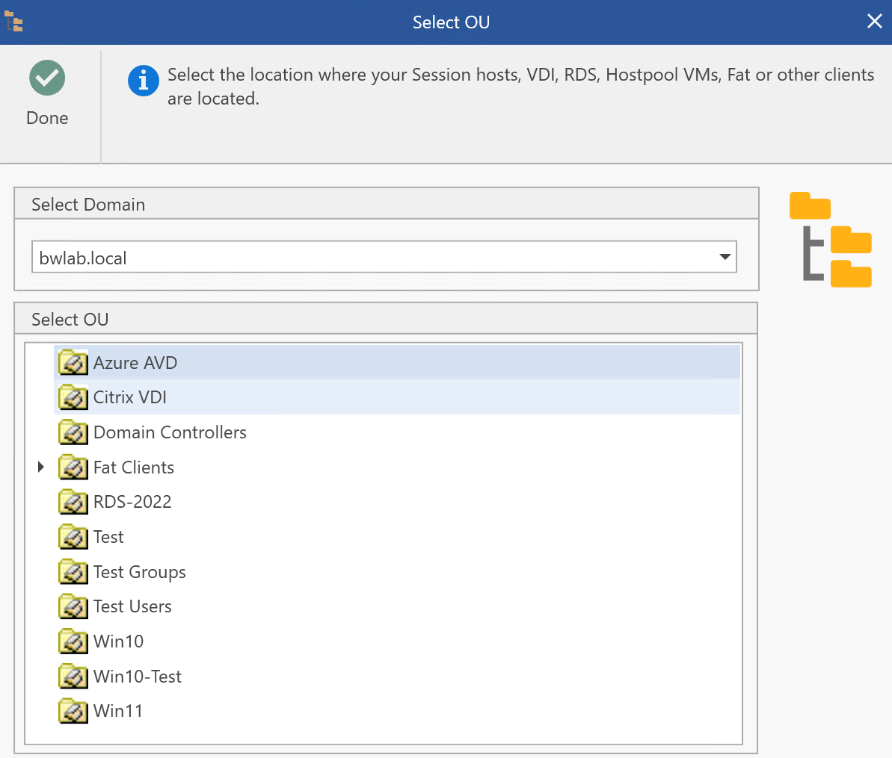
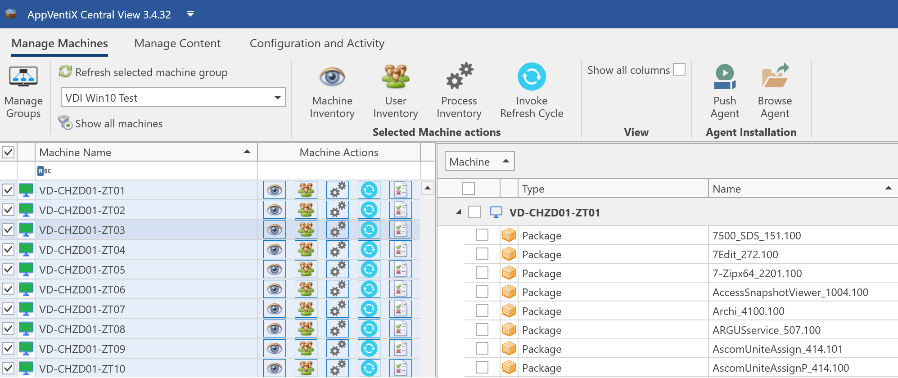
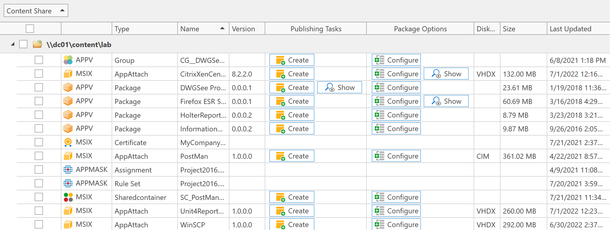
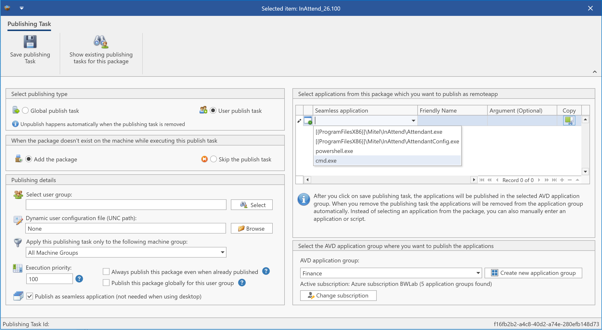

# AppVentiX 3.4.32 release notes

We are excited to announce that AppVentiX 3.4 is now available, this version builds upon its successful 3.3 predecessor, so make sure to read previous release notes as well.

## What's new in AppVentiX 3.4

## Remotely push agent installation to machine(s)

It's now possible to remotely push the agent installation to machine(s), this makes it easy to install and upgrade the agent directly from the Central View console. Silent and automated installations are still possible. It's also possible to see the installed agent version in the machine inventory.

## Improved OU picker

The OU picker has been re-designed and gives a better experience when a machine group is configured. You can also select another domain.

## Multimachine select

You can now select multiple machines in the machine inventory, this makes it possible to inventory only selected machines and invoke the refresh cycle on only selected machines instead of the whole machine group

## New columns have been added in the content inventory

You can now see the package size and other detailed package information in the content inventory

## Improved seamless application publishing

Extended support for seamless application publishing scenarios (RemoteApp without full desktop), besides applications from the package it's now also possible to select scripts and native processes

## Other improvements

The following list of improvements are also implemented in version 3.4:

- You can now see which packages have a deployment configuration file configured in the content inventory
- The Azure Virtual Desktop (AVD) integration has been enhanced and it's now also possible to easily switch between subscriptions and tenants. This makes it easy to manage multiple AVD environments across different subscriptions
- Support for nested groups and multi-domain environments has been enhanced
- The installation and upgrade has been simplified and the time to get up and running has been reduced
- You can now see which content share(s) have pre-cache enabled in the content inventory
- The agent can now enable the App-V client, no need to enable it separately
- The agent can now enable remote management automatically
- The MSIX app attach conversion and integration has been enhanced
- Enhanced MSIX package update process
- Enhanced integration with Fslogix and support for Java rule sets have been added
- Improved support for Azure file shares
- Multiple other fixes and improvements

---

*Source: [AppVentiX release history](https://appventix.com/appventix-release-history/).*
