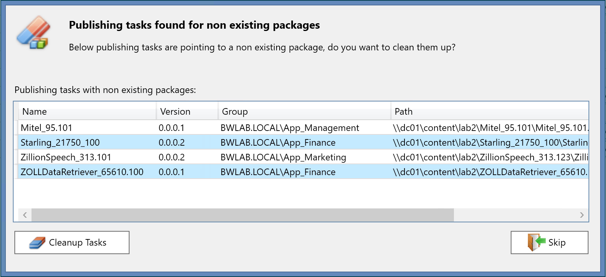
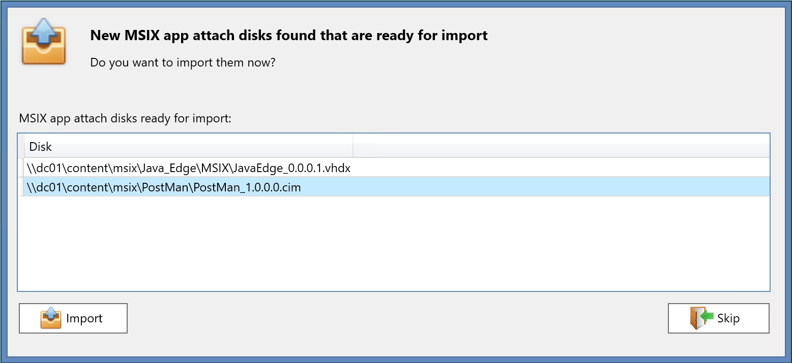
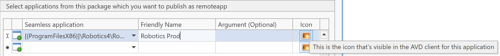
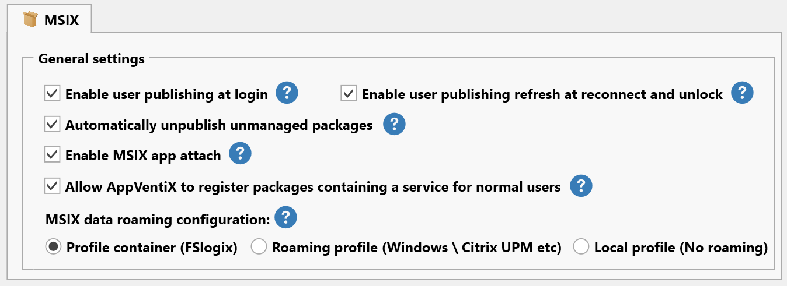
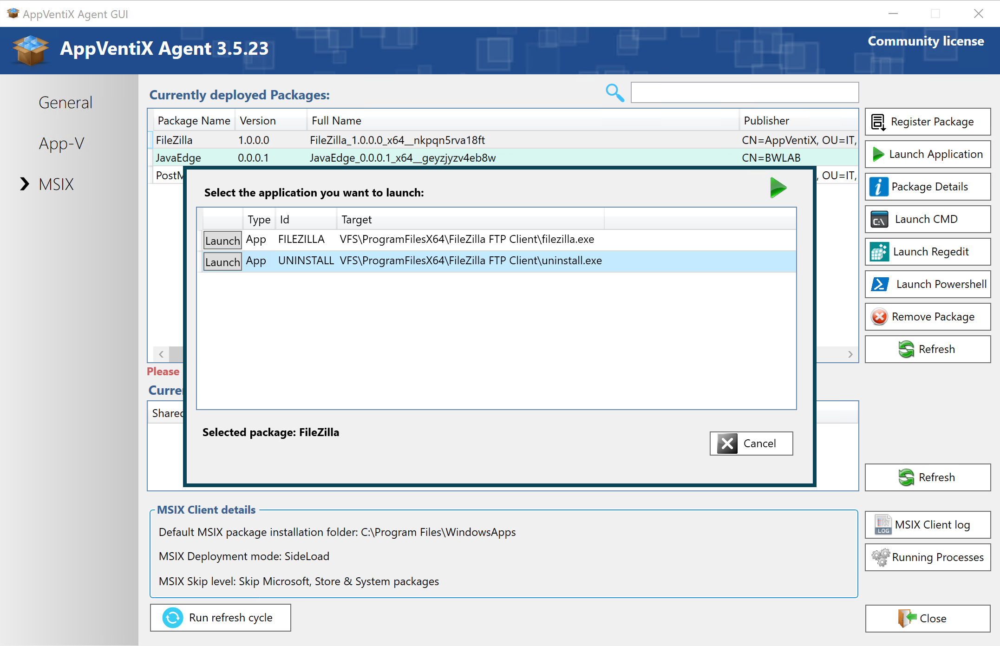

# AppVentiX 3.5.23 release notes

We are excited to announce that AppVentiX 3.5 is now available, make sure to read the release notes of version 3.4 as well to check out all the latest features.

## New features and improvements in AppVentiX 3.5

## Housekeeping

A new housekeeping functionality has been added, AppVentiX will now automatically detect if there are publishing tasks configured for non-existing packages. For example when a package has been updated or removed from the content share you will receive below informational pop-up so you are aware of any publishing tasks that are pointing to non-existing packages. From here, you can directly cleanup the old publishing tasks, this will keep your application publishing information clean and consistent.

## Import existing app attach packages

A new app attach feature has been added which allows you to import existing app attach packages created with other tools. When new app attach packages are found in the content inventory the below popup is displayed allowing you to import the app attach package. After import they become visible in the content inventory and are instantly ready for delivery.

## Select custom icons for AVD publishing

You can now select a custom icon when publishing applications to AVD. By default the icon from the selected application is used. Now you can also select another icon by clicking on the icon button.

## Improved content inventory

The content inventory is now much quicker, multiple improvements have been made to improve the inventory time.

## New MSIX package data roaming options

It's now easier then ever to configure MSIX package data to roam with the user. Just select the profile solution you are using and AppVentiX will make sure the MSIX data is roamed with the user correctly. Below a screenshot of the options you can configure for MSIX data roaming. Also new logging have been added for this feature.

## Improved application launch experience through AppVentiX Agent GUI

Launching applications and processes through the AppVentiX agent GUI has been improved for both App-V and MSIX. You can now select between applications in the package and easily select the application you want to start, also shortcut launch is now supported.

## Other improvements

The following list of improvements are also implemented in version 3.5:

- Remote machine inventory can now be configured to use SSL
- Fix has been added for deploying FSlogix Java rule sets
- Fix has been added for publishing applications in AVD where the hostpool is in a different Azure resource group then the AVD workspace
- Sometimes when removing a publishing task, the application was not unpublished automatically from AVD, this has been fixed
- It's now possible to start new published AVD applications without having to run a refresh for already logged in users. This also works for applications published in Citrix.
- Timestamp server is now automatically populated when converting packages to MSIX
- The convert to MSIX app attach feature has been improved
- Logging has been improved, it's easier to navigate and find information
- Multiple other fixes and improvements

---

*Source: [AppVentiX release history](https://appventix.com/appventix-release-history/).*
