# AppVentiX 3.6.36 release notes

We are excited to announce the latest release of AppVentiX! AppVentiX 3.6 is now available for download and contains a lot of new features and improvements.

AppVentiX is acclaimed by IT industry experts for providing real-time, easy and powerful management of App-V and MSIX (app attach) applications in on-premises, hybrid and cloud native environments.

If you are new to AppVentiX make sure to read the previous release notes as well to get a good understanding of all the capabilities AppVentiX has to offer.

If you are new to MSIX, you can read more about MSIX on the AppVentiX website.

- Entra ID (Azure AD) support
- New inventory and remote management features
- Use a (service) account to access the configuration and content share
- Limit administrative access to AppVentiX to selected administrators
- Improved push agent and silent installation options
- Improved migration from App-V to MSIX and side by side management
- See details of application packages
- Much more!

## New features and improvements in AppVentiX 3.6

## Entra ID (Azure AD) support

AppVentiX now supports Entra ID (Azure AD) joined machines and stand-alone machines. Line of sight with a domain controller is no longer needed as of this release. Of course, Active Directory domain joined machines are still supported. This allows AppVentiX to support a wide range of use cases. No matter if machines are running on premises or in the cloud, management happens in exactly the same way.

Entra ID (Azure AD) joined machines are now visible in the console:

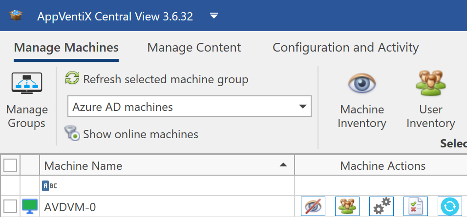

And App-V and MSIX packages can be assigned to Entra ID (Azure AD) groups:

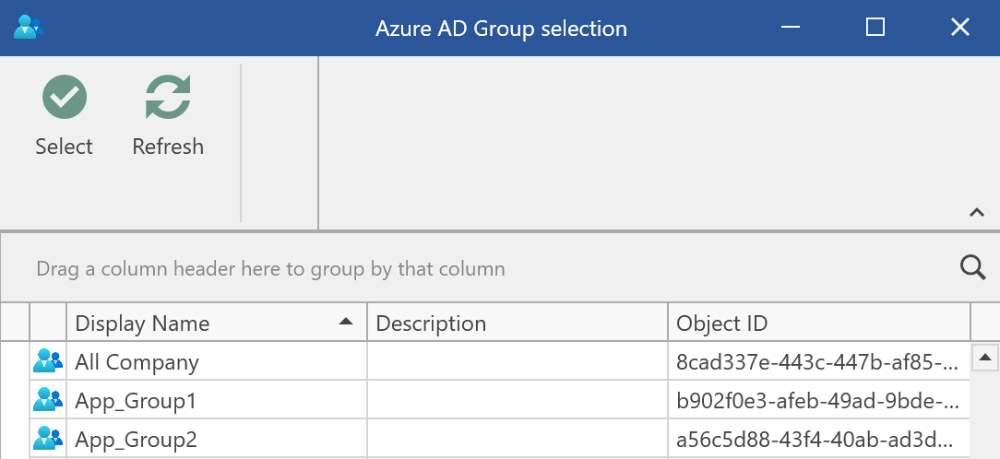

## Improved inventory and remote management capabilities

Machine inventory now leverages the configuration share, a direct connection is no longer required. This feature is enabled by default for new machine groups and can be enabled for existing machine groups if you desire. This improves the performance of the inventory process and a WinRM connection is no longer required (also to initiate a refresh). Below are some screenshots of the new inventory feature.

The user inventory have been improved and will show you all connected users on the machine ,and which applications they have published:

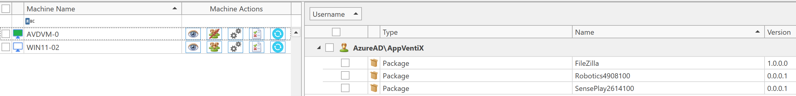

The machine inventory has been improved and will show you if packages are a deployed as native MSIX or delivered through app attach:

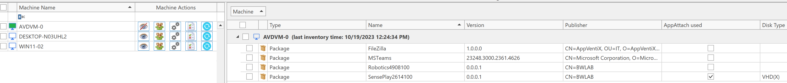

The improved inventory process applies to both MSIX and App-V:

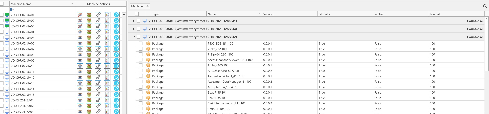

Events are added to the machine overview, making it easy to report and search for events:

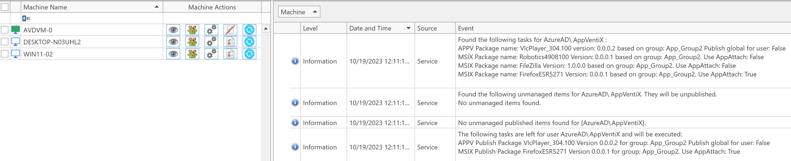

## Use a (service) account to access the configuration share

Besides integrated authentication - where AppVentiX uses your logged in credentials - you can also specify a (service) account to access the shares:

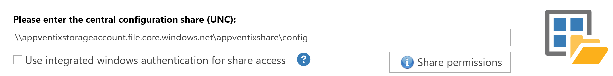

This works for all file shares, including Azure file shares. There is a "share permissions" button which will show you exactly which permissions are needed to configure the share. When you configure a service account, you can also install the agent silently to use the same account for share access which makes the deployment even more effortless.

## Limit administrative access to AppVentiX Central View

Administrative access to AppVentiX can be limited to a selected group of administrators. In the Central View settings, you can configure an Active Directory or Entra ID (Azure AD) group to allow console access. If a user is not in this group, it's impossible to start the console.

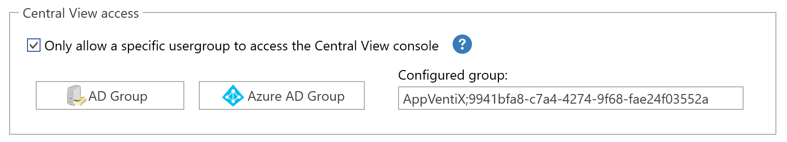

## Improved push agent and silent installation options

The agent version is now visible next to the machine in the manage machines overview, all you have to do is click on "show online machines" and you will see the agent versions together with the machines that are online.

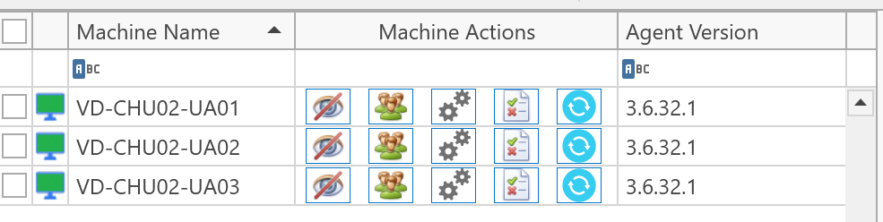

The lightweight AppVentiX agent can be pushed from the AppVentiX management console but also be incorporated in your deployment system. The silent installation parameters can now be retrieved from the console, which makes it easy to include in your preferred image deployment solution or pipeline.

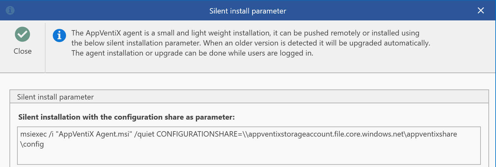

## See details of application packages

A new package details window has been added where you can see the applications inside the package. These are the shortcuts that are presented to the user when the package is published for the user.

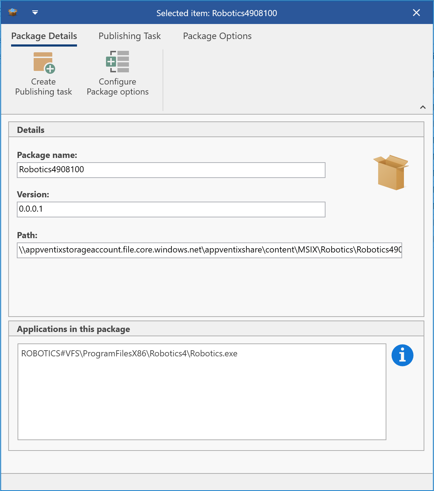

## Other improvements

The following list of improvements are also implemented in version 3.6:

- The AVD integration has been enhanced, it's now also possible to publish scripts that run inside the App-V or MSIX container
- Multi-session OS improvements
- AppVentiX is now FIPS compliant
- Improved support for offline use cases where there is no network connection
- Citrix PVS\MCS image mode detection has been updated
- App-V packages are now mounted when added by a publishing task (when the package is configured to mount)
- New options in the AppVentiX agent GUI like the possibility to repair a package
- MSIX app attach improvements
- MSIX shared container improvements
- The Community edition is not limited to 5 machines anymore, but only to 3 applications
- Improved support for Azure file shares, also when not AD integrated
- Improved logging
- Multiple other fixes and improvements

---

*Source: [AppVentiX release history](https://appventix.com/appventix-release-history/).*
