# AppVentiX 3.7.25 release notes

- Enhanced Central View Console: Now featuring Windows 11-inspired themes with automatic detection of light and dark mode preferences.
- Effortless Package Imports: Seamlessly import packages from both the Windows Store and AppVentiX Store.
- Import packages from AppVentiX: This includes test applications for deployment validation, along with a convenient application refresh tool. This allows users to initiate a refresh at their convenience directly from their start menu.
- AppVentiX PowerShell Module: A new PowerShell module for automating the creation of publishing tasks.
- Enhanced Active Directory Integration: Introduces Active Directory group matching based on SID.
- Azure AD and AVD Integration: Improvements for seamless integration with Azure AD and Azure Virtual Desktop.
- MSIX Staging Improvements: Streamlined MSIX staging and automatic deployment of dependencies.
- Automated Disk Detachment: New feature to automatically detach unused app attach disks.
- Selective Publishing Tasks: Introduces a feature allowing the processing of publishing tasks only for packages on designated content shares configured for the machine group.
- Improved Package Drain Feature: Enhancements to the package drain feature.
- Efficient Migration: Improved migration tools for transitioning from App-V to MSIX, alongside enhanced side-to-side management.
- And Much More: Explore additional enhancements and features in this release!

## New features and improvements in AppVentiX 3.7

## Enhanced Central View Console with Windows 11-Inspired Themes

The Central View console now features updated themes inspired by Windows 11, seamlessly aligning with its modern look and feel. While the original theme remains accessible, you can choose it by using the "Select Theme" button on the configuration page. Below you will find a screenshot of the new theme:

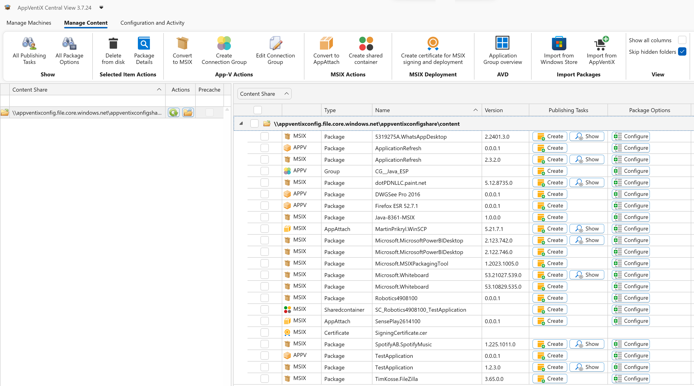

## Automatic detection of light and dark mode preferences

The Central View console now intelligently adapts to your system's light and dark mode settings, ensuring a seamless experience. Explore a glimpse of the enhanced dark mode through the provided screenshots below:

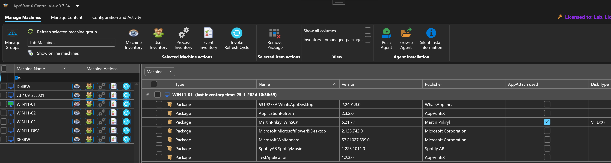

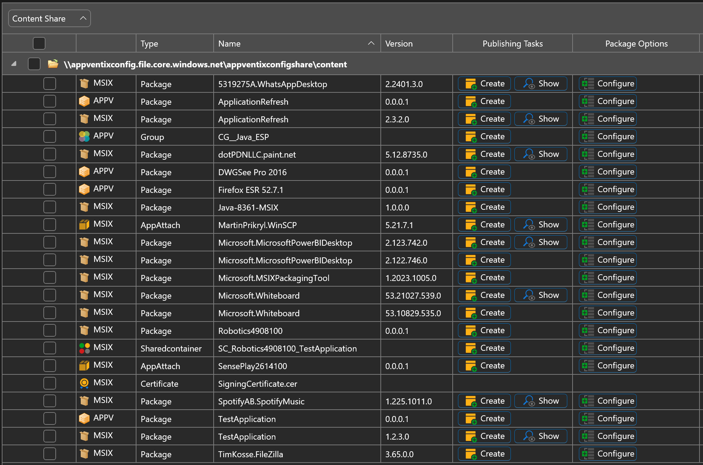

## Import packages directly from the Windows Store and AppVentiX Store

On the content page you will find 2 new buttons to directly import packages from the Windows Store and packages provided by AppVentiX:

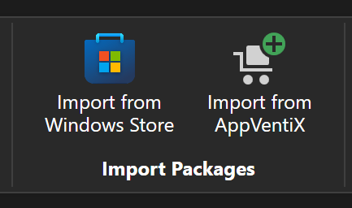

Importing MSIX packages from the Windows Store can be done with just a few clicks - just provide the Store ID of the application and click on search. The console conveniently showcases examples, such as PowerBI, WhatsApp, WhiteBoard, and the MSIX packaging tool. The package is automatically selected and ready for import:

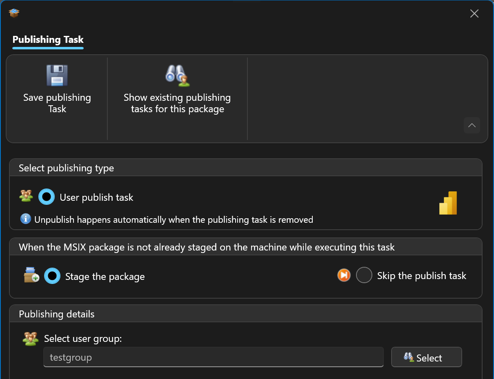

After import the application is visible in the content inventory, and you can configure a publishing task:

The user gains instant access to the new application or updated version without the need to log off and on again.

The "Import from AppVentiX" button enables you to import App-V and MSIX packages published by AppVentiX. This encompasses test applications for deployment validation, along with a convenient application refresh tool. This allows users to initiate a refresh at their convenience. Here are some examples of the packages you can import:

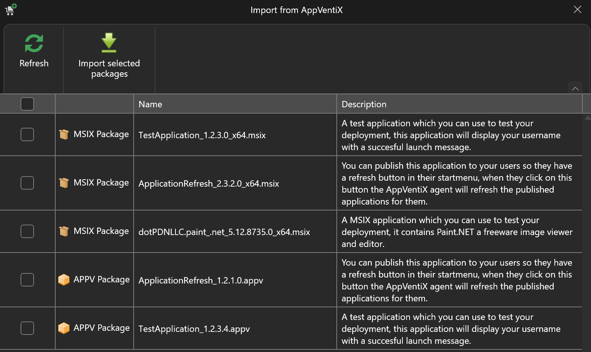

The Application Refresh tool places a user-friendly button in the start menu, allowing users to initiate a refresh effortlessly:

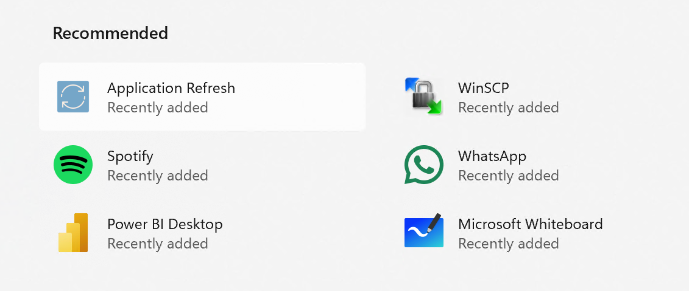

## AppVentiX PowerShell Module

Explore the convenience of our new PowerShell module designed for automating the creation of publishing tasks. Simply install the module on the same machine where Central View is located or directly from the PowerShell gallery. For usage examples and assistance, consult the help section in the AppVentiX Central View.

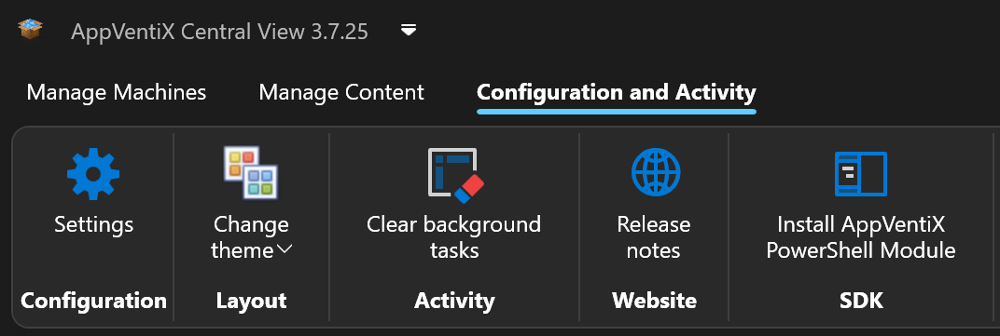

## New feature to automatically detach unused app attach disks

A new feature has been added that will automatically detach unused app attach disks. By default, app attach disks are detached when a machine is rebooted. But often multiuser OS and RDS based machines are less frequently rebooted. This feature will release the disk automatically when it's no longer in use by other users on the machine allowing you to modify or archive the app attach disk. This feature will also limit the number of attached disks on the machine to only the disks that are currently in use. The feature can be enabled in the agent settings:

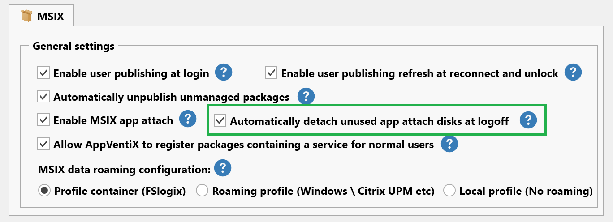

## Selective Publishing Tasks

This release introduces a new feature allowing the processing of publishing tasks only for packages on designated content shares configured for the machine group. By default, publishing tasks are executed for users on machines regardless of where the package is stored, so a package could be added to a machine from a content share which has not been configured for a machine group. With this setting only publishing tasks are executed for packages that are on one of the content share(s) configured for the machine group others will be skipped. This will allow you to better split production and test packages without having to configure the machine group filter in the publishing task. This feature can be enabled in the agent settings:

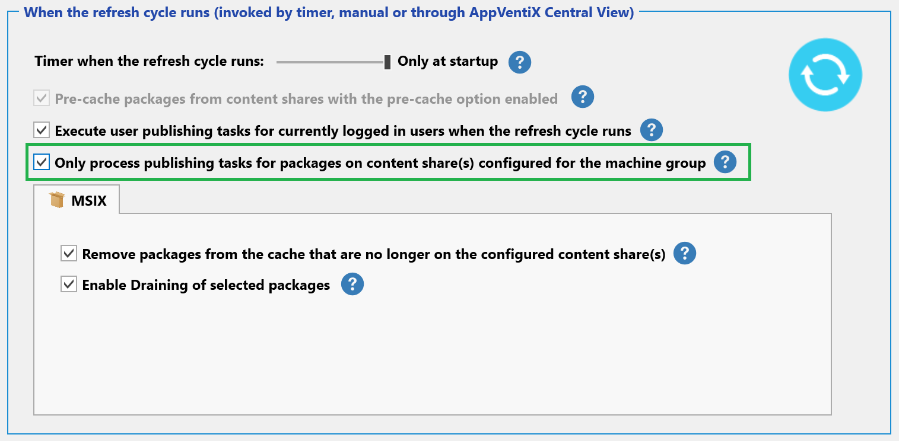

## Improved Package Drain Feature

Draining a package is now even easier than ever, just click on the package and select drain. The publishing tasks associated with the package will be automatically removed and the package will be unpublished and removed from the machines.

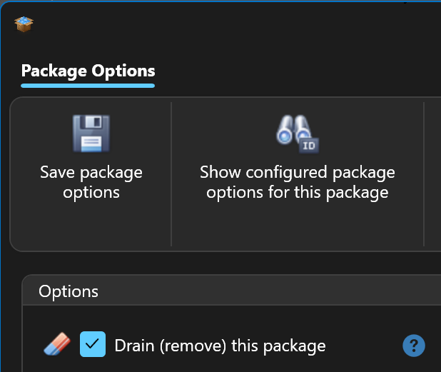

## Package Details Window

The package details window now also shows the package icon, the applications included in the package and if the package has dependencies they will also be shown:

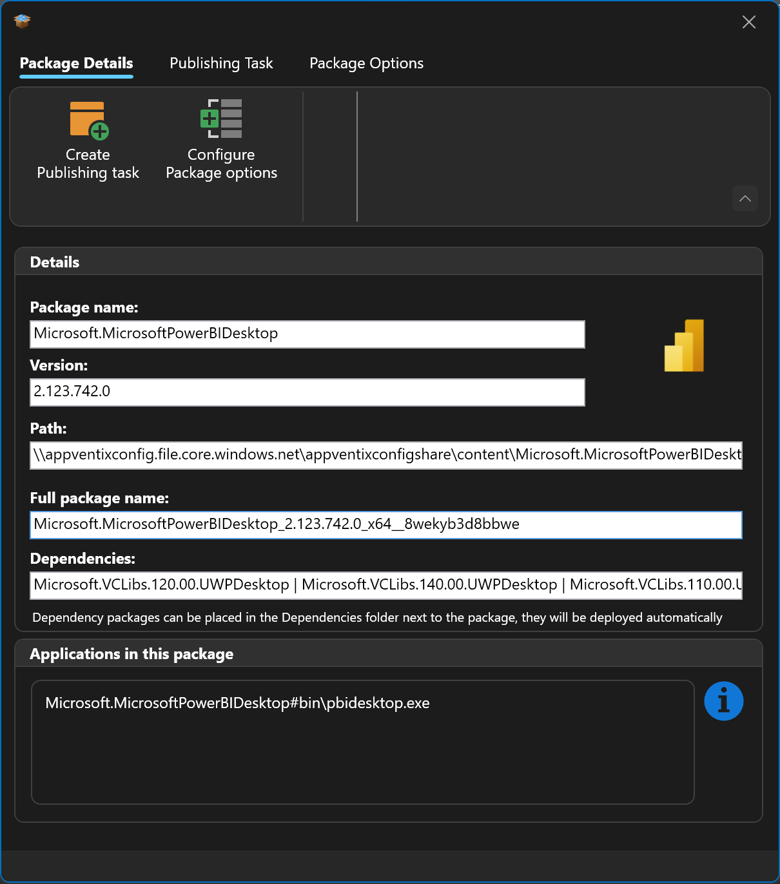

## Other improvements

The following list of improvements are also implemented in version 3.7:

- The configuration share check has been optimized
- Multi-session OS improvements for both AVD and RDS scenarios
- Native MSIX staging improvements
- Various MSIX delivered by app attach improvements
- Ability to inventory all MSIX packages on a machine (also unmanaged)
- Inventory feature has been optimized for both App-V and MSIX
- The display name of the application is now correctly retrieved and displayed for seamless RemoteApp publishing scenarios
- Language-specific fixes has been addressed for issues in the inventory feature
- Numerous fixes for reliable Active Directory group retrieval
- Multiple other fixes and improvements

---

*Source: [AppVentiX release history](https://appventix.com/appventix-release-history/).*
