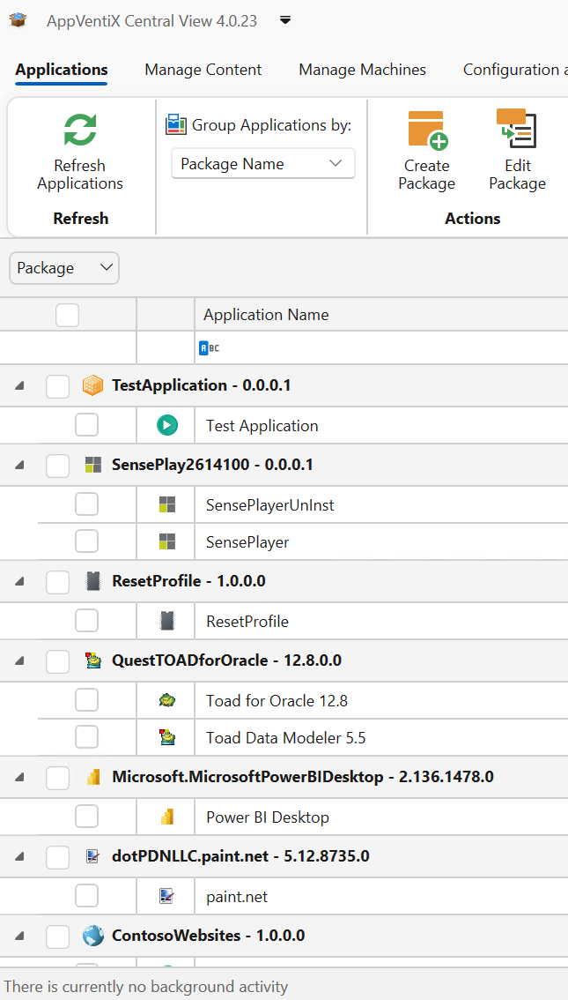
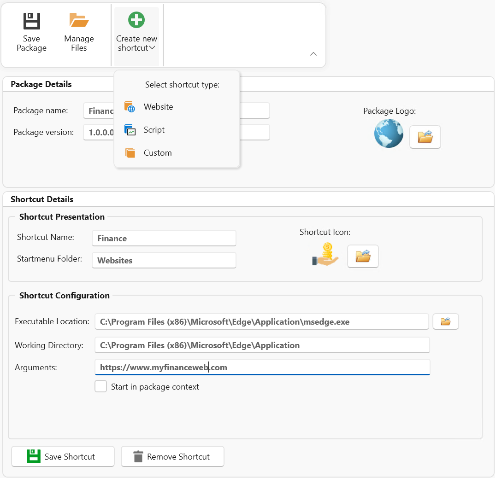
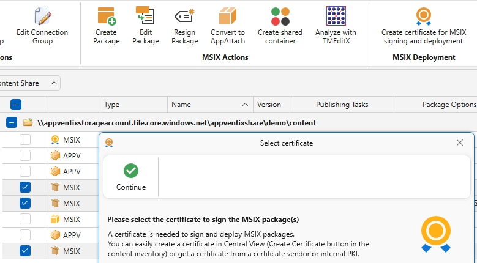
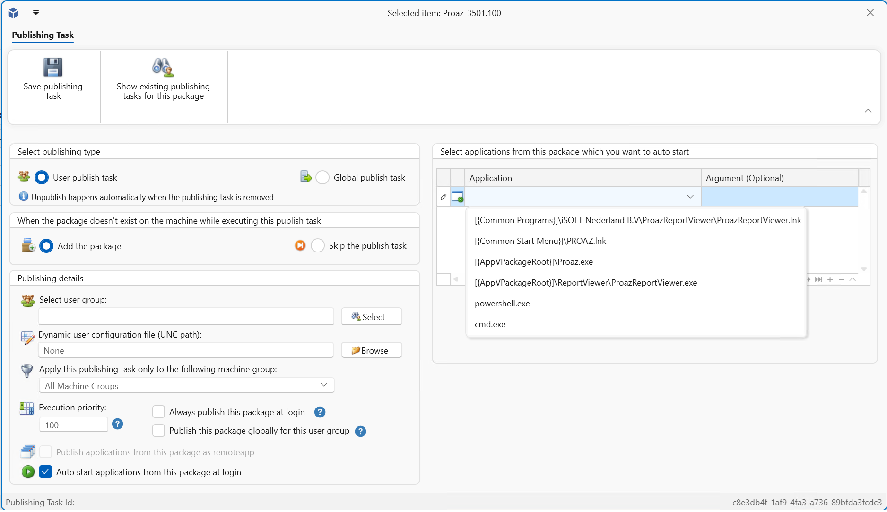
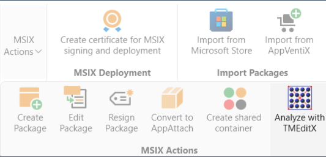
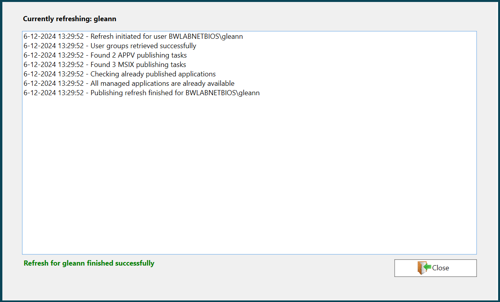
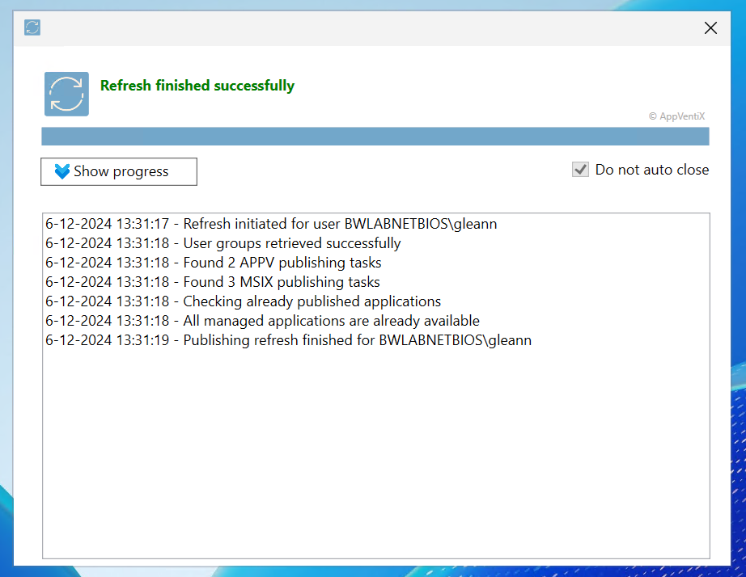

# AppVentiX 4.0.26 release notes

## New features and improvements in AppVentiX 4.0

## Application overview page in Central View

A new application overview page in Central View showing all applications and shortcut locations in one easy to navigate view.

## Create and edit existing packages

Create and edit existing packages, easily create packages directly from the AppVentiX console to manage your shortcuts, files and scripts.

## Bulk resign your MSIX packages

Bulk resign your MSIX packages, with the click of a button resign multiple MSIX packages with a new certificate

## Auto start applications

You can now define applications from a package that will be auto started for the user when they login

## Integration with TMEdit(x)

Integration with TMEdit(x) to analyze packages directly from the console

## A new publishing progress window

A new publishing progress window has been added to the AppVentiX agent GUI

## New application refresh application

The application refresh application has been renewed to show the refresh progress when the user clicks on the shortcut in their start menu

## Extended support for App-V

While Microsoft is retiring the App-V management infrastructure, the App-V client will remain supported. AppVentiX eliminates the need for App-V management components, ensuring fully supported deployment by both AppVentiX and Microsoft

## First-day support for Windows Server 2025

First-day support for Windows Server 2025 and the latest Windows 11 builds. AppVentiX has been thoroughly tested and validated for compatibility with Windows Server 2025, ensuring seamless functionality for App-V integration, MSIX, and app attach features.

## Other improvements and fixes

The following list of improvements are also implemented in version 4.0:

- Added new context menus in the console for easier navigation
- Improved content inventory performance and caching
- Warnings and errors in the event log now include unique event IDs for easier troubleshooting
- The feature preventing Windows from cleaning up packages when no user is logged in has been improved. Windows will now retain all packages managed by AppVentiX, ensuring consistent availability.
- Enhanced MSIX app attach integration
- Enhanced support for MSIX Shared Containers
- The Entra ID and Azure Virtual Desktop (AVD) integration has been improved
- The Azure subscription is now stored in the publishing task, so when you edit the publishing task the correct subscription is automatically selected
- The remote inventory feature has been enhanced
- For Citrix environments the image mode detection feature has been updated for the latest MCS\PVS versions
- Improved content caching mechanisms for optimized performance
- Improvements for scenarios when the MSIX cache is redirected to another drive
- Resolved an issue where creating a publishing task could occasionally open an empty window
- Fixed compatibility issues with importing older Microsoft Store package formats
- Package icons are now retrieved during inventory for improved usability
- Updated themes and controls for a modernized user experience
- Optimized group retrieval method that skips publishing when user group retrieval is partial
- Enhanced support for offline scenarios and situations where the configuration share is unavailable
- The PowerShell module has been updated
- Various other fixes and improvements for overall stability and functionality

---

*Source: [AppVentiX release history](https://appventix.com/appventix-release-history/).*
