# AppVentiX 5.2.53 release notes

## New features and improvements across the AppVentiX platform

- In addition to the SMB-based configuration store option, configurations can now be stored directly in [Azure Blob Storage](../admin-guide/azure-blob-storage/index.md), eliminating the need for file shares. Hybrid environments are also supported through mixed configuration store combinations.

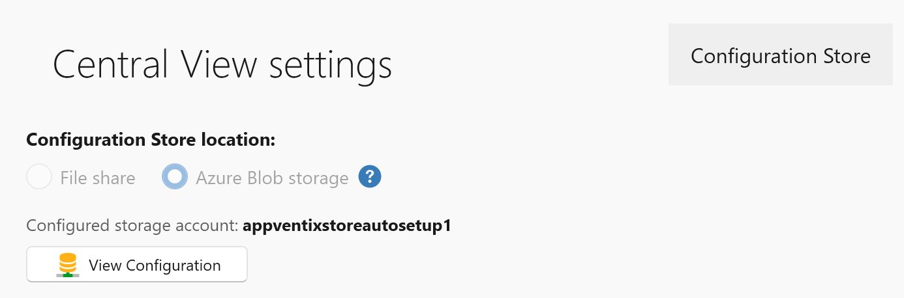

- Multiple sites can now be created from the Settings window, allowing multiple configurations to run side by side. For example, an on-premises Citrix or cloud AVD\W365 based environment alongside an Entra ID laptop environment.

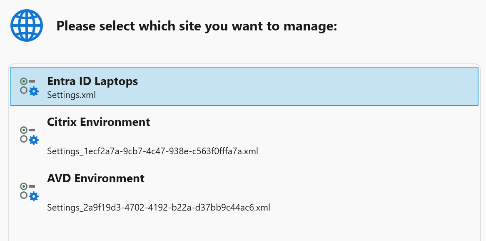

- A new "Backup Site" button has been added to the Settings window to quickly create a backup (snapshot) of the configuration store.

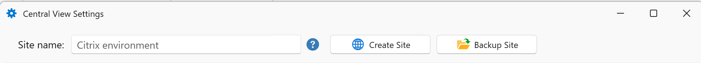

- For new configurations, the configuration store is now organized into folders to better align with the configured RBAC role permissions. RBAC configuration remains optional.

- Default user settings created by AppVentiX team members can now be imported, allowing you to quickly apply commonly used workspace fine-tuning options such as hiding default Start menu shortcuts, locking down Settings and Control Panel, and more. These default user setting templates will be updated regularly.

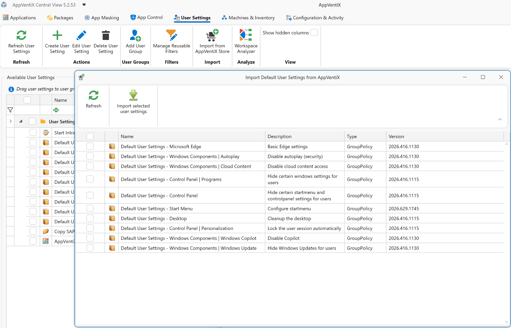

- [Multiple OUs](../quickstart/create-machine-groups.md#active-directory-ou) can now be configured for Active Directory machine group types, including nested OU support.

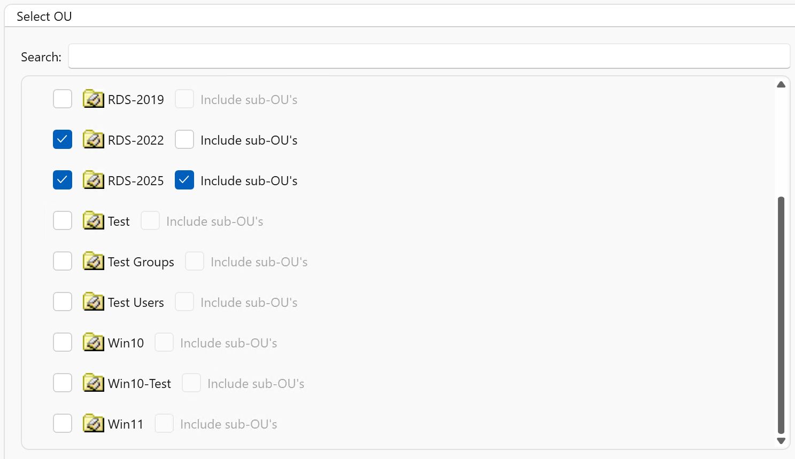

- Support has been added for machine groups in other forests and domains than the one where the machine running the Central View console resides.

- Machine groups now include a priority setting. When a machine belongs to multiple machine groups, this priority determines which agent settings take precedence and are applied.

- Support has been added for multiple Entra ID machine group types, including dynamic name filters and dynamic groups selected from Entra ID.

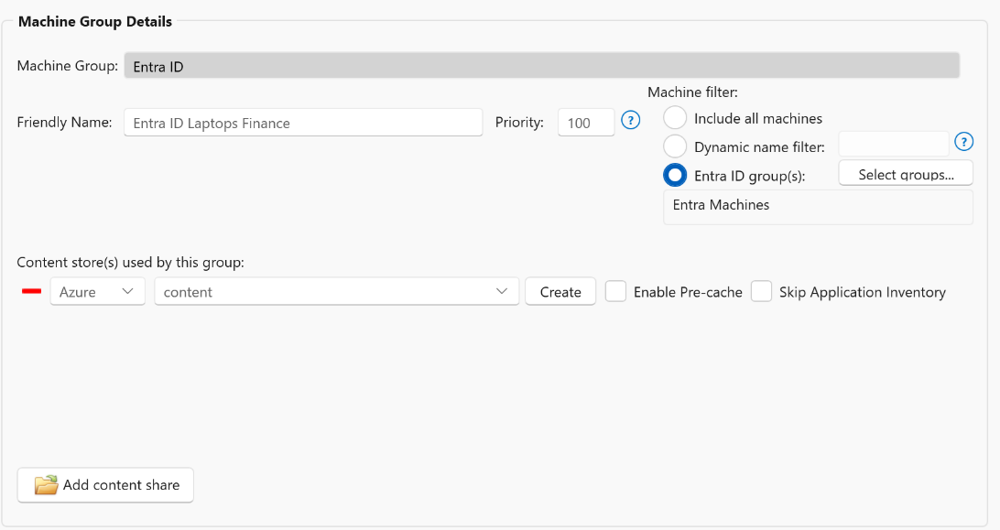

- A new Workspace Analyzer feature has been added, allowing you to select a user or user group and quickly see which packages, user settings, app masking rules, and app control policies are applied.

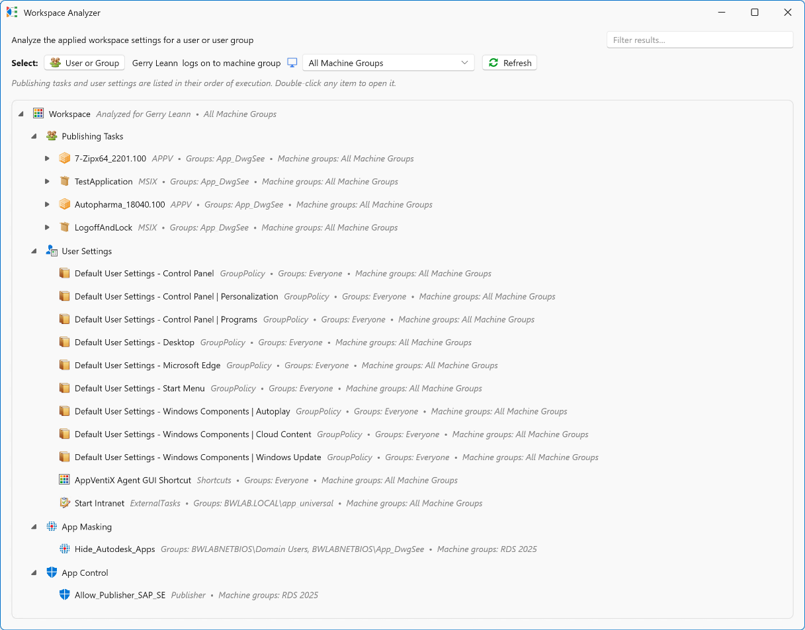

- The RBAC role implementation has been improved, and an additional option has been added to limit concurrent real-time machine inventory based on the active role.

- New refresh settings have been added to the agent settings, allowing you to hide the refresh window during user logon and adjust the applet size when users initiate a refresh using the refresh shortcut.

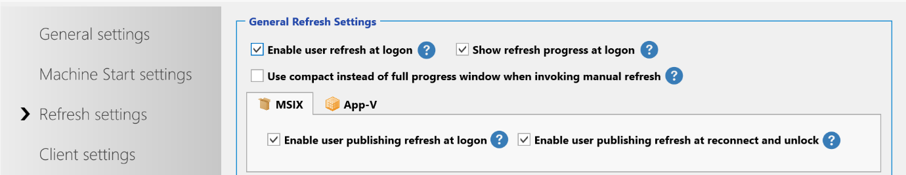

- LDAP(S) usage is now optional and is only used to refresh a user's group membership without requiring the user to log off and back on again. When LDAP(S) is disabled, users must log on again for group membership changes to take effect, but LDAP(S) will no longer be used.

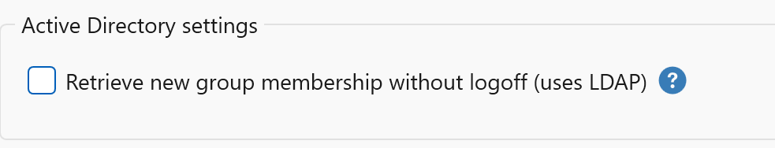

- The agent installation process has been simplified. Only a connectionstring parameter is now required, which contains all information needed to connect to the configuration store.

- New AppVentiX docs page, replacing the old PDF admin guide.

- Updated AppVentiX PowerShell module including multiple fixes and improvements.

## MSIX improvements

- The process for creating packages and shortcuts has been improved.

- The execution order of MSIX publishing tasks (for both native and app attach packages) was not honored. This has been fixed.

- Version comparison has been improved to ensure package versions are evaluated correctly. This fixes an issue where an older package version could incorrectly be detected as newer than the actual latest version.

- Azure Artifact signing is now supported to sign MSIX packages.

## APPV improvements

- Dynamic deployment configuration file editing and deployment improvements.

- The AppVentiX Agent GUI has been improved, including better support for selecting multiple App-V packages and improved sorting behavior.

- Packages could be automatically loaded to 100%, even when on-demand streaming was enabled, if a service account had been configured. This has been fixed.

- The AppVentiX Migration Toolkit, used to import packages from an App-V server into AppVentiX, has been improved.

## User Settings / Workspace management improvements

- [Reusable filters](../admin-guide/user-settings-filters/index.md) can now be created and applied across multiple user settings. These filters can be used to target settings based on machine name, subnet, or the existence of registry keys, with wildcard support included.

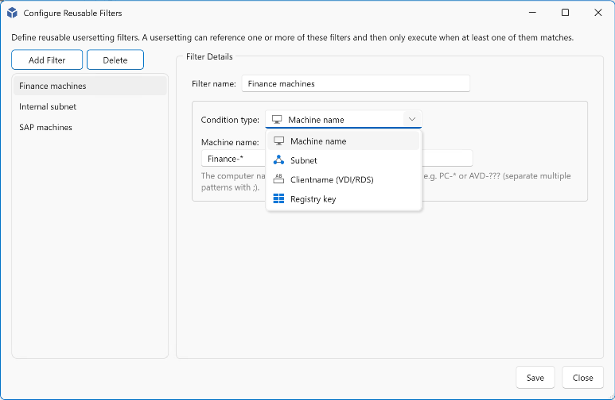

- A new filter option, "Excluded groups," has been added for user settings. While user settings are assigned to user groups, this additional filter allows you to define groups that should be excluded from receiving those settings.

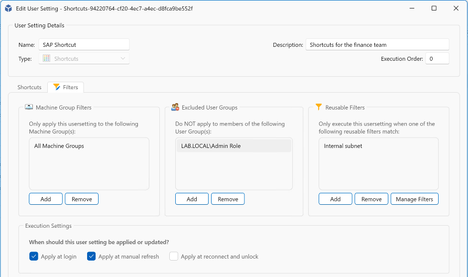

- User settings were already removed when they were no longer assigned to a user. This behavior has now been extended so that user settings are also removed when no assignments remain for the user.

- User settings configured with "RunOnce" can now be reset, allowing them to be applied once again the next time they are processed.

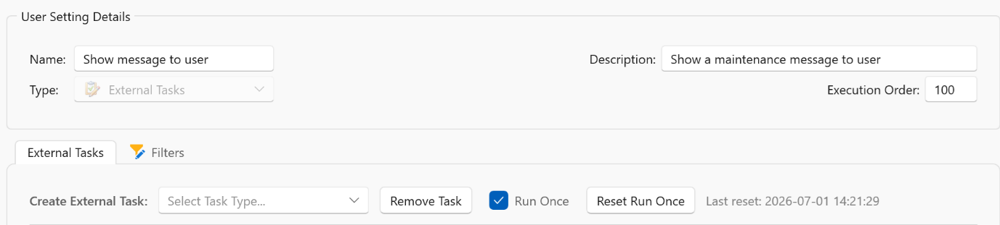

## App Control improvements

- App Control policies can now be signed with a certificate to further enhance security. Signing App Control policies helps ensure they cannot be tampered with.

- Azure Artifact Signing support has been added for signing App Control policies.

- App Control block and audit event logging have been improved to include publisher information, making it easier to create App Control policies directly from event data.
