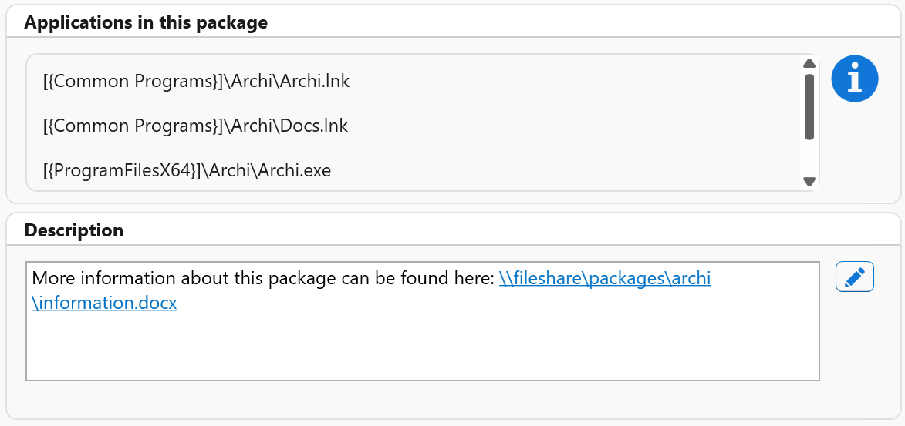
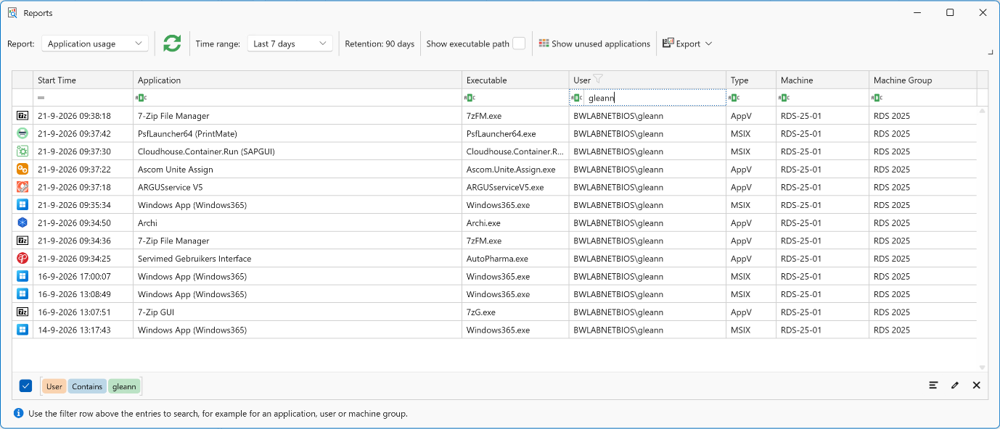
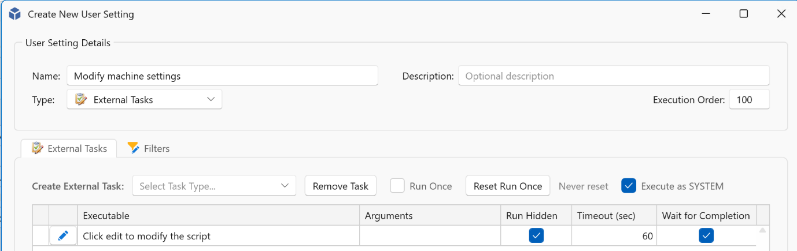
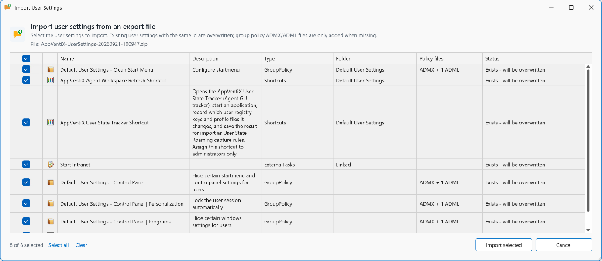
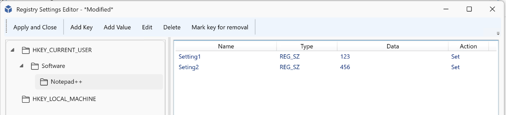
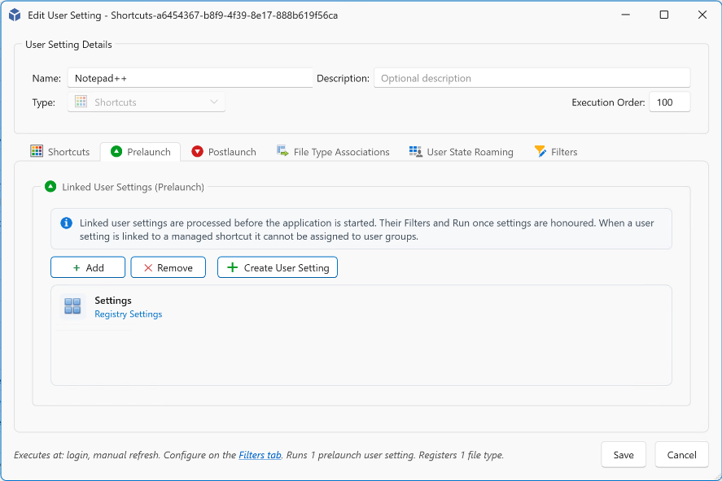
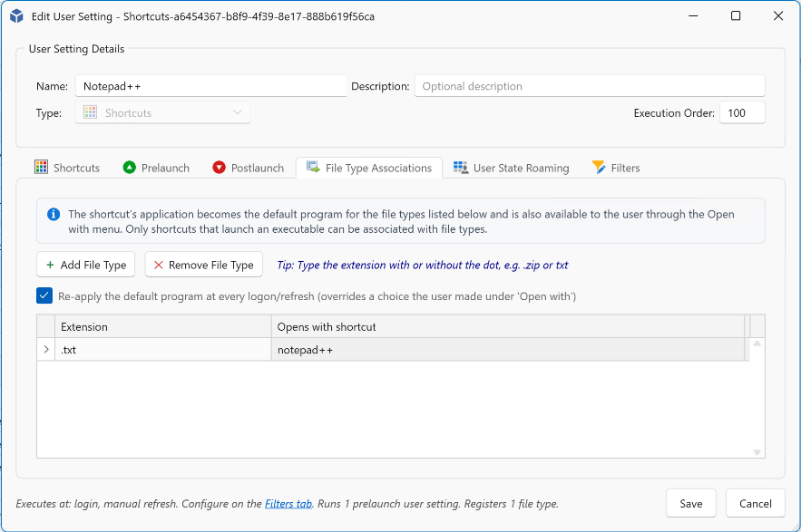
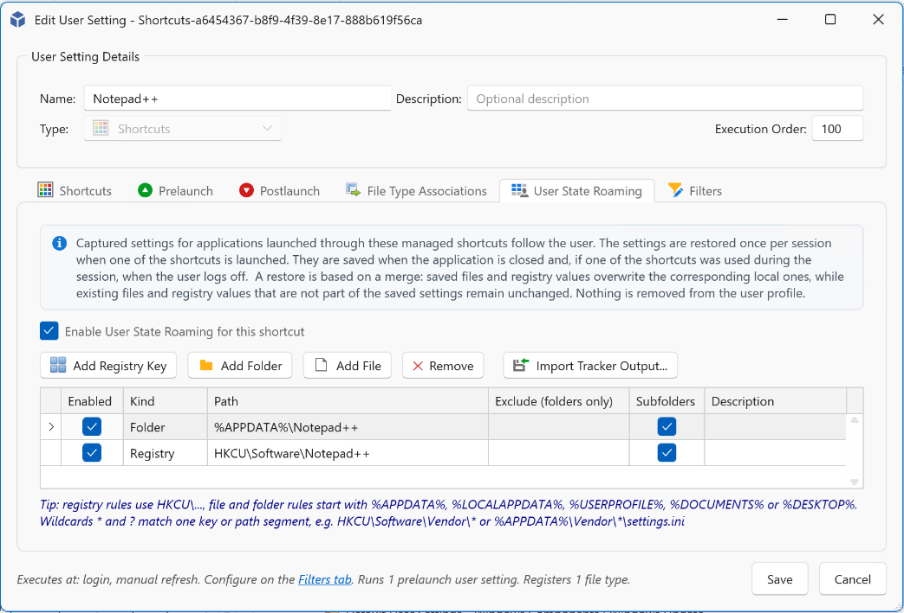
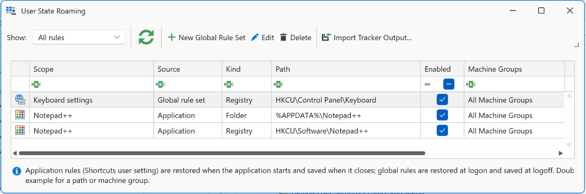

# AppVentiX 5.3.25 release notes

AppVentiX 5.3 is now available! This release introduces Application Usage Reporting, AppVentiX Agent Event Log Reporting, import and export of user settings, pre-launch and post-launch actions for managed shortcuts, and User State Roaming. Of course, we have improved App-V and MSIX delivery too!

## New features and improvements

- **App-V Deployment Configuration**: App-V Deployment Configuration files can now be processed for packages that are already deployed. It is no longer necessary to remove a package before activating or updating its Deployment Configuration.
- **MSIX Shared Containers**: Improved the deployment and management of MSIX Shared Containers. Administrator permissions are no longer required to enable a shared container.
- **Package description field**: App-V and MSIX packages now include a description field in the package details window, which can be used to add notes or additional information about a package. Hyperlinks to documentation are also supported.

- **Reporting**: A new reporting feature has been introduced for tracking application usage across App-V, MSIX, and locally installed applications. Usernames can optionally be anonymized. A new report has also been added that provides a consolidated view of AppVentiX Agent events. Both reports can be exported to Excel or PDF. Reporting can be enabled per machine group.

- **External Tasks**: External tasks configured in User Settings can now be executed in the machine context.

- **User Settings import and export**: User Settings can now be exported and imported, making it easier to migrate configurations between different AppVentiX sites.

- **User Setting registry editor**: Registry settings now include a built-in editor, making it easier to configure and manage registry settings.

- **Managed Shortcuts configuration extensions**: Several new configuration options have been added to Managed Shortcuts:
    - **Pre-launch and post-launch actions**: Managed Shortcuts can now execute configurable actions before and after an application is started. These actions can, for example, be used to set registry values or copy files.

    

    - **File Type Associations (FTAs)**: Managed Shortcuts now support the configuration of File Type Associations.

    

    - **User State Roaming**: User State Roaming can save and restore application-specific user settings, including user profile files and registry settings, when applications are opened and closed. Global rules can also be configured to save and restore user state during logoff and logon. User State Roaming can be enabled per machine group.

    

    

- **Workspace Analyzer**: The Workspace Analyzer has been extended with additional functionality and improvements. Workspace Analyzer lets you select a user or user group and provides a clear overview of all applications and settings that apply to that user or group.
- **Central View console improvements**: Multiple UI enhancements have been introduced, including:
    - The Application View page has been removed from the main interface and is now available in a dedicated window.
    - New multi-selection options, for example when unassigning settings.
    - Improved UI refresh behavior when configurations, such as package options, are changed.
    - Audit trail, reporting, and other information can now be exported to PDF and Excel.
    - User Settings can be grouped by type, making them easier to find and giving you a clearer overview.
    - User groups can now be copied and pasted between different publishing tasks for App-V and MSIX packages.
- **Default User Settings**: New default User Settings are available in the console, making it easier to start with a baseline configuration.
- **App Control enhancements**: Several improvements have been made to App Control management, including:
    - Extended base policy editing capabilities.
    - Improved signing process for App Control policies.
- **AppVentiX PowerShell module**: The AppVentiX PowerShell module has been updated and improved, including enhancements for:
    - Importing existing App-V Server configurations.
    - Importing Ivanti Building Blocks.
    - Automating AppVentiX management tasks.

## Fixes

- Fixed an issue with AppVentiX Agent authentication against Microsoft Entra.
- Fixed an issue where some global settings were not saved correctly.
- Multiple improvements have been made to the MSIX package editor, including a fix that allows shortcuts starting with a numeric value to be saved correctly.

---

*Source: [AppVentiX release history](https://appventix.com/appventix-release-history/).*
